# Praktikum Git
### A. Deskripsi Proyek
Landing page dari sebuah website manajemen pesanan warung makan yang bernama “Warung Nusantara”. 

### B. Cara Menjalankan
1. Jalankan perintah: git clone https://github.com/anggakoesno/praktikum-git-25-555724-SV-25838.git
2. Buka folder proyek
3. Buka file landingpage.html di browser

### C. Tampilan Halaman
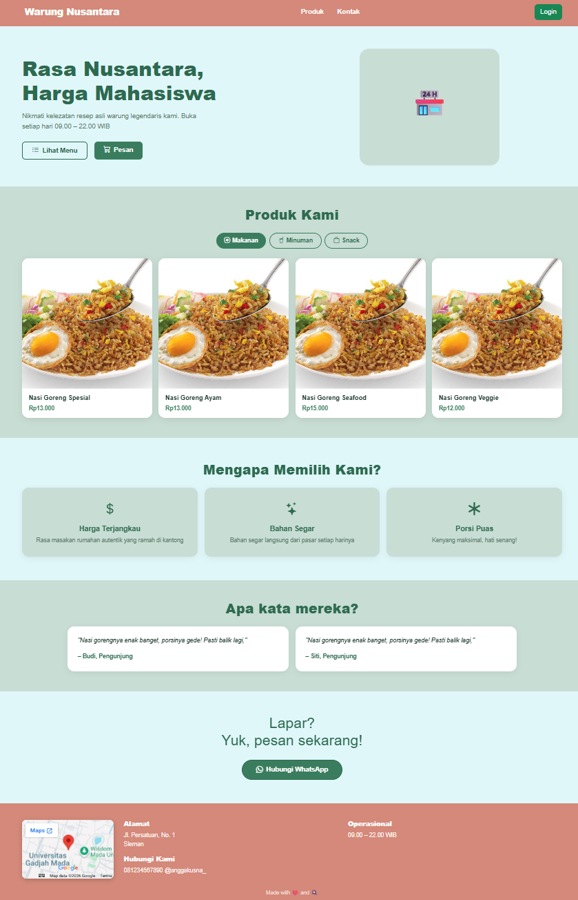

### D. Dokumentasi Perintah Git
| Perintah | Contoh | Fungsi |
| -------- | ------ | ------ |
| git init | 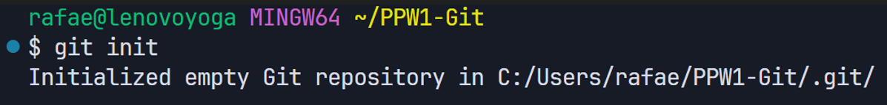 | Inisialisasi repository lokal |
| git remote add origin [url_repositori] | 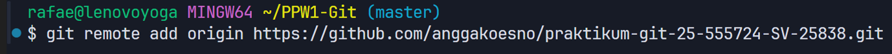 | Menghubungkan repositori Git lokal ke repositori jarak jauh (contohnya GitHub) |
| git add | 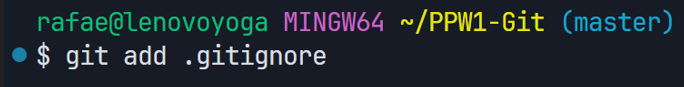 | Menambahkan ("." -> semua) file ke area staging |
| git commit | 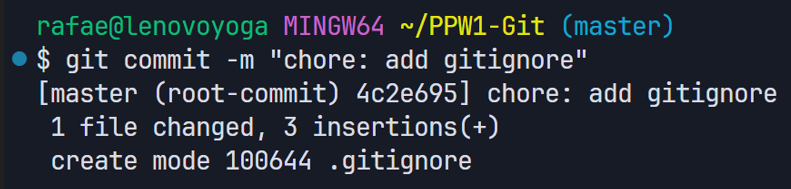 | Menyimpan perubahan (dari file yang berada di staging) dengan pesan konvensional |
| git branch -M [nama_branch] | 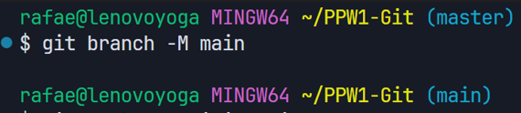 | Mengubah (-M) nama branch utama (dari default master) menjadi main |  
| git push (-u) origin [nama_branch] | 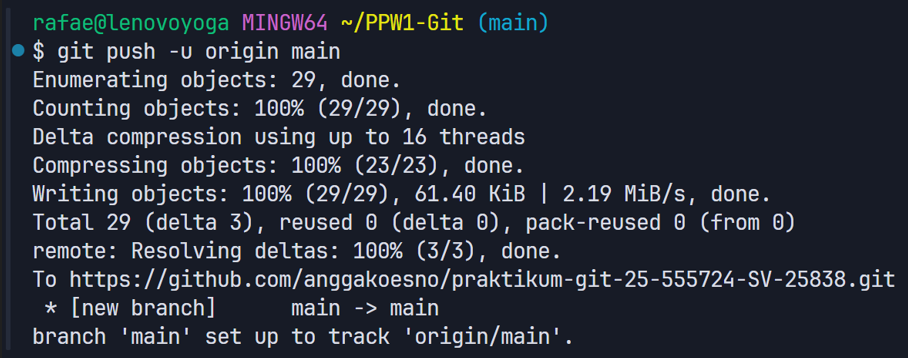 | Mengunggah hasil commit dari lokal ke repository jarah jauh (contohnya GitHub). Gunakan "-u" saat push pertama kali untuk menghubungkan branch lokal ke remote|
| git branch [nama_branch] | 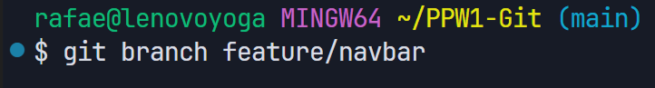 | Membuat branch baru yang bernama "[nama_branch]" |
| git checkout [nama_branch] | 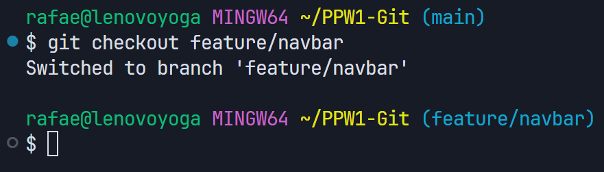 | Pindah ke branch yang bernama "[nama_branch]" |
| git merge [nama_branch] | 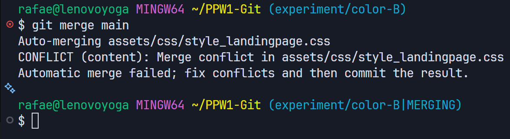 | Menyatukan perubahan dari branch saat ini ke branch yang bernama "[nama_branch]" (biasanya )
| git rebase | 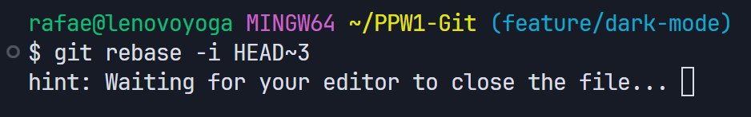 | Merapikan atau menggabungkan rangkaian komit ke atas komit dasar yang baru |

### E. Dokumentasi Lainnya
#### 1. Hasil git log --oneline --graph
##### a. Rangkaian commit pertama
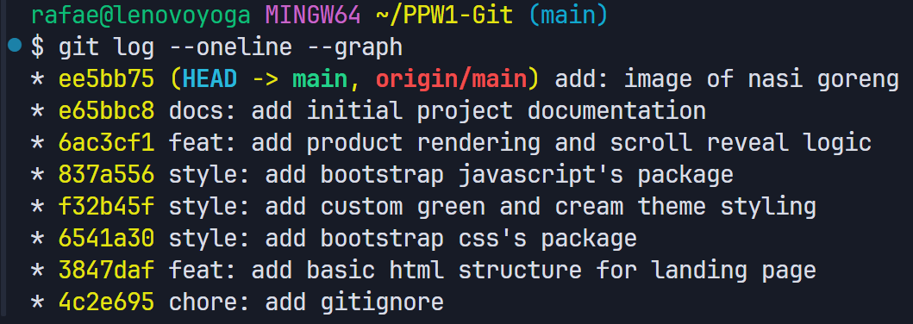

##### b. Rebase interaktif
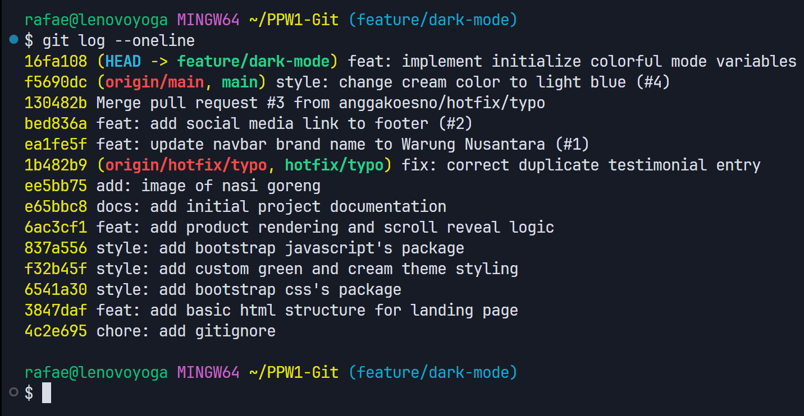

#### 2. Branch protection rule
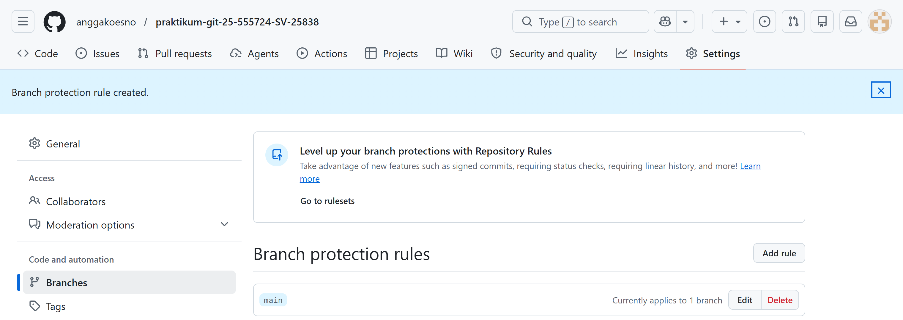